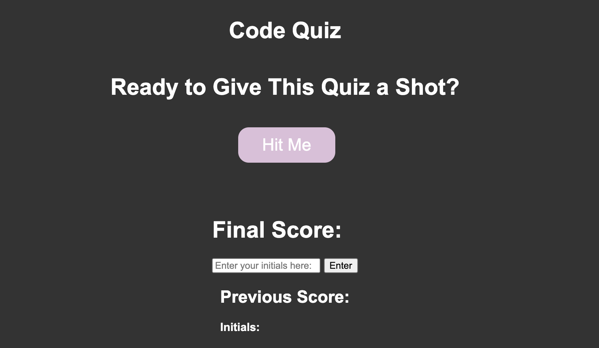
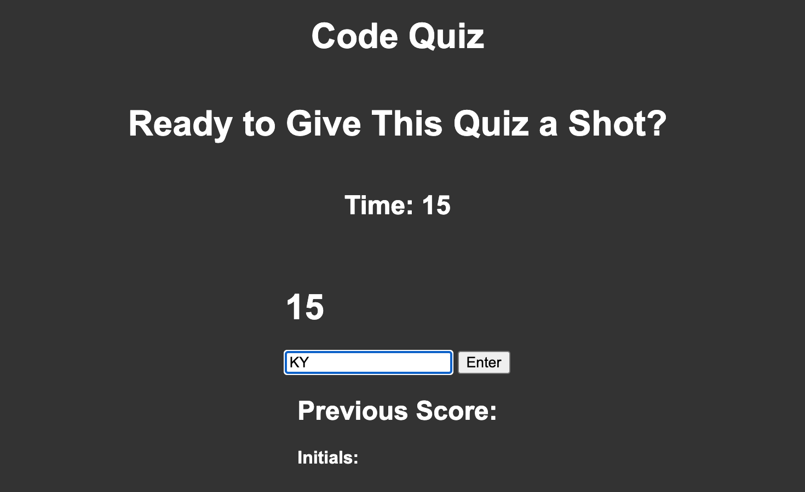

# Code-Quiz

## Description: 

Created a code quiz so that when the user clicks the start button a timer starts and they are presented with a question. When they answer a question the they are presented with another question. 
If the user answers a questions wrong time is subtracted from the clock and when all questions are answered or the timer reaches 0 the quiz is over and the user can enter their initials. 

 

## Link to deployed application:
https://doublelforce5.github.io/Code-Quiz/

